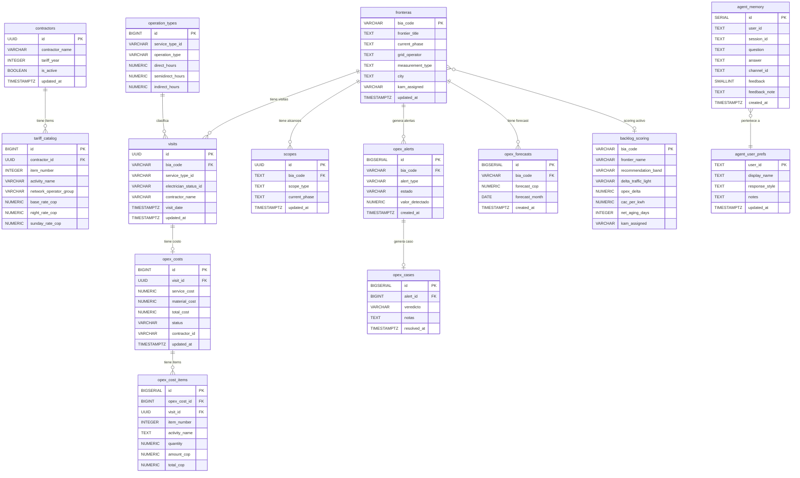

# Arquitectura MVC — Oráculo del OPEX · BIA Energy

**Proyecto:** Agente de IA para monitoreo de costos OPEX  
**Stack:** n8n Cloud · Supabase (PostgreSQL) · Claude AI · Slack · Metabase  
**Fecha:** 30 de abril de 2026

---

## Entregable 1 — Diagrama de Estructura de Carpetas (MVC)

```
Oraculo-del-opex/
│
├── 📂 model/                              ← CAPA MODELO (datos y esquema)
│   ├── 03_DDL_Supabase_OPEX_Agent.sql     → Schema principal (10 tablas fuente)
│   ├── 08_DDL_Memoria_Feedback_Prefs.sql  → Schema IA (agent_memory, agent_user_prefs)
│   └── 02_Diseno_BD.dbml                  → Diseño entidad-relación
│
├── 📂 controller/                         ← CAPA CONTROLADOR (lógica de negocio)
│   │
│   ├── 📂 ingesta/                        → Sincronización de datos (CRUD Read + Write)
│   │   ├── 05_WF-A1_Ingesta_Horaria.json  → Ejecuta cada hora (incremental updated_at)
│   │   └── 05_WF-A2_Ingesta_Semanal.json  → Ejecuta cada semana (full scan)
│   │
│   ├── 📂 agente/                         → Inteligencia artificial (CRUD Read + Write)
│   │   ├── 06_WF-B_Agente_Claude.json             → Orquestador principal (Claude AI)
│   │   ├── 06_WF-B-T1_Tool_QuerySupabase.json     → Herramienta: SQL libre a Supabase
│   │   ├── 06_WF-B-T2_Tool_BacklogAlerts.json     → Herramienta: alertas del backlog
│   │   └── 06_WF-B-T3_Tool_CostoEstimado.json     → Herramienta: cálculo de costo OPEX
│   │
│   └── 📂 receptor/                       → Entrada de eventos (routing)
│       └── 07_WF-C_Slack_Receptor.json    → Recibe Slack Events API, enruta a WF-B
│
├── 📂 view/                               ← CAPA VISTA (interfaces de usuario)
│   ├── [Slack] #opex-alertas              → Alertas automáticas de desvíos
│   ├── [Slack] #opex-aprobacion           → Flujo de aprobación de anomalías
│   ├── [Slack] #opex-cierre               → Reportes de cierre mensual
│   ├── [Slack] #opex-errors               → Errores del sistema
│   └── [Metabase] Cards 66793 / 65209 / 19440  → Dashboards de costos y backlog
│
└── 📂 docs/                               ← DOCUMENTACIÓN
    ├── 01_Fuentes_de_datos_Metabase.md    → Catálogo de fuentes y campos
    ├── 04_Queries_WF-A_Metabase.md        → Queries de extracción Metabase
    ├── 09_Arquitectura_MVC_OPEX.md        → Este documento
    └── Requerimientos_BD_Agente_OPEX_BIA.docx → Requerimientos formales
```

### Mapeo MVC

| Capa | Tecnología | Responsabilidad |
|------|-----------|-----------------|
| **Model** | Supabase (PostgreSQL) | Almacena, valida y sirve los datos. DDL define el esquema. |
| **Controller** | n8n Cloud + Claude AI | Procesa solicitudes, ejecuta lógica, escribe/lee del modelo. |
| **View** | Slack + Metabase | Presenta resultados al usuario. No contiene lógica de negocio. |

### CRUD por capa

| Operación | Quién la ejecuta | Sobre qué tabla |
|-----------|-----------------|-----------------|
| **Create** | WF-A1 (INSERT) | fronteras, visits, opex_costs, opex_cost_items, contractors |
| **Read** | WF-B herramientas (SELECT) | Todas las tablas vía query_supabase |
| **Update** | WF-A1 (UPSERT) / WF-C (feedback) | Tablas fuente / agent_memory.feedback |
| **Delete** | WF-A1 (DELETE selectivo) | opex_cost_items (re-ingesta limpia) |

---

## Entregable 2 — Diagrama de Base de Datos (Tablas y Relaciones)



### Leyenda de relaciones

| Símbolo | Significado |
|---------|------------|
| `\|\|--o{` | Uno a muchos (obligatorio → opcional) |
| `\|\|--o\|` | Uno a uno (obligatorio → opcional) |
| `}o--o\|` | Muchos a uno (opcional → opcional) |

### Grupos de tablas

| Grupo | Tablas | Origen |
|-------|--------|--------|
| **Maestras** | contractors, fronteras, operation_types | Metabase (externas) |
| **Transaccionales** | visits, opex_costs, opex_cost_items, scopes | Metabase (externas) |
| **Scoring** | backlog_scoring | Metabase (calculada) |
| **Agente** | opex_alerts, opex_cases, opex_forecasts | n8n (generadas) |
| **Memoria IA** | agent_memory, agent_user_prefs | n8n (aprendizaje) |

---

*Generado automáticamente desde el repositorio del proyecto. Stack: n8n 1.123.33 · Supabase (PostgreSQL 14) · Claude Sonnet 4.6 · Slack Events API.*
